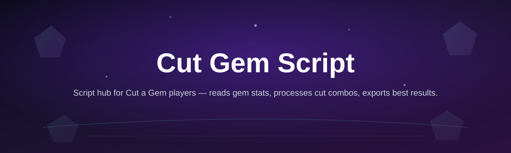
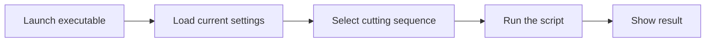

# cut-a-gem-script-hub

*A tidy way to run the Cut a Gem Script without wrestling with dev tools first.*

### Before / After

| | Before | After |
|---|---|---|
| Setup | Manual dependency chasing, mismatched runtimes | One download, one launch |
| Interface | Console-only, easy to fumble | Clean window, clear buttons |
| Updates | Re-search for the "latest working" copy | Landing page always points to current build |
| Trust | Random forum links | Single maintained source with changelog |

This table is the short version of why this repo exists — the rest of the README fills in the details.

## What this is

**cut-a-gem-script-hub** is the home base for the Cut a Gem Script, packaged as a standalone Windows tool instead of a loose file you have to configure yourself. The Cut a Gem Script itself is a small utility built around one job: streamlining a repetitive gem-cutting workflow so you spend less time on setup and more time on the actual task you opened it for.

This repo doesn't host the raw script inline — it's the documentation and discovery point. The actual build lives on the linked landing page, versioned and updated independently of this README, so you're never stuck running something outdated or unverified.

  

The button above opens the project landing page, where the current build of the Cut a Gem Script is available to download.

## Who it is for

- **Players** who run gem-cutting sequences often enough that doing it by hand feels wasteful.
- **Guild or crew organizers** who need a consistent, repeatable result across sessions.
- **Windows users** who want something that opens and works, without installing a runtime first.
- **Returning users** of earlier Cut a Gem Script versions looking for a stable, maintained build.
- **Newcomers** who searched "Cut a Gem Script" and want the actual thing, not a wall of ads.

## What you can do

- **Launch the Cut a Gem Script directly** from a single executable, no setup wizard.
- **Run repeated cutting sequences** without retyping the same steps each time.
- **Keep a consistent window layout** so muscle memory carries over between sessions.
- **Check for the current build** from the same landing page every time, instead of hunting old links.
- **Close and reopen freely** — nothing here needs to stay running in the background.
- **Read the changelog on the landing page** before updating, so you know what changed.
- **Use it on a fresh Windows install** without pulling in extra runtimes or libraries.
- **Uninstall cleanly** by deleting the folder — no registry sprawl, no installer leftovers.

## Getting started

1. Open the download link from the button above or the one at the bottom of this page.
2. On the landing page, grab the current build of the Cut a Gem Script.
3. Save it somewhere you'll remember — a dedicated folder is fine.
4. Run the executable. Windows may show a first-run prompt; that's normal for unsigned indie tools.
5. Follow the on-screen steps to start your first gem-cutting run.

## Requirements

- Windows 10 or Windows 11 (64-bit)
- No separate runtime, framework, or toolchain install
- Standalone executable — nothing to compile, nothing to configure beforehand
- A few megabytes of free disk space

<strong>How it works</strong>

The Cut a Gem Script follows a short, predictable path from launch to result:

1. The executable starts and reads whatever settings you left from last time.
2. You pick or confirm the cutting sequence you want to run.
3. The script executes that sequence in order.
4. The result is shown in the window — no hidden logs to dig through.
5. Settings are saved automatically for the next launch.

<strong>FAQ</strong>

**Is the Cut a Gem Script still updated in 2026?**
Yes — the landing page reflects the current build, and this repo tracks it as the source of truth.

**Do I need to install anything before running it?**
No. It's a standalone Windows executable. If Windows flags it on first run, that's typical for small independent tools without a paid code-signing certificate.

**Does it work on Windows 10 and Windows 11?**
Yes, both are supported. There's no separate build for either version.

**Can I run it without an internet connection?**
After downloading, yes — the script itself doesn't require a live connection to run.

**Where do I report a bug or ask a question?**
Use this repository's Issues tab. Include your Windows version and what you were doing when it happened.

<strong>Troubleshooting</strong>

**Windows shows a warning before it opens.**
This is standard for unsigned indie executables. Review the source (this repo and its landing page), then choose to proceed if you trust it.

**The window opens but looks blank.**
Give it a second — first launch reads and writes local settings before drawing the interface. If it stays blank past a few seconds, relaunch it.

**Nothing happens when I double-click the file.**
Check that the download completed fully; a partial download won't run. Re-download from the landing page if the file size looks off.

**A previous version won't start after updating.**
Delete the old folder entirely before placing the new build, so leftover settings files don't conflict.

## License

Released under the [MIT License](LICENSE). The Cut a Gem Script is provided as-is, without warranty — use it at your own discretion, and always download from the linked landing page to make sure you're running the maintained build.

  

